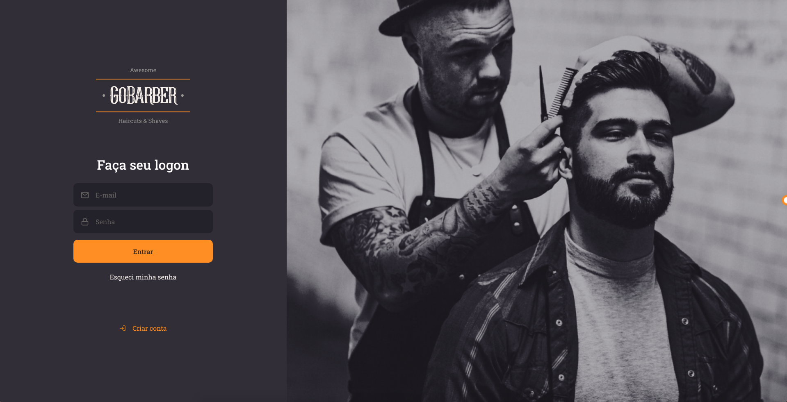
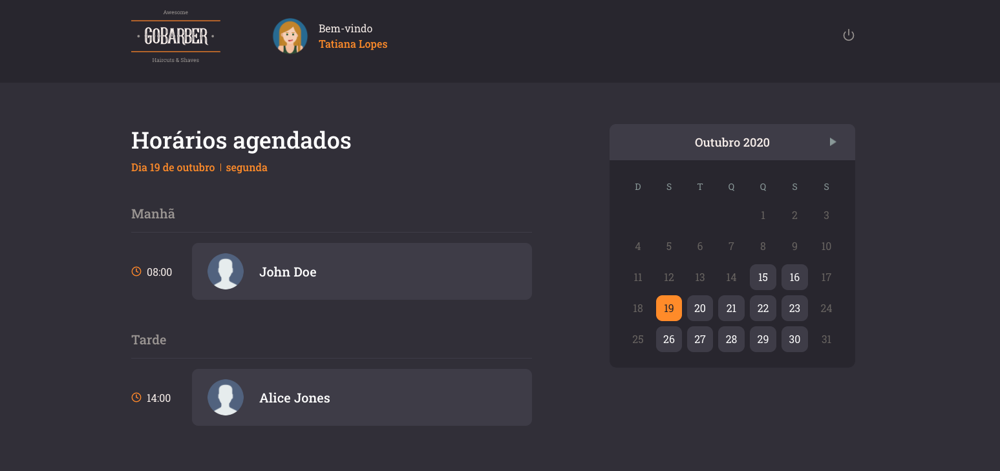
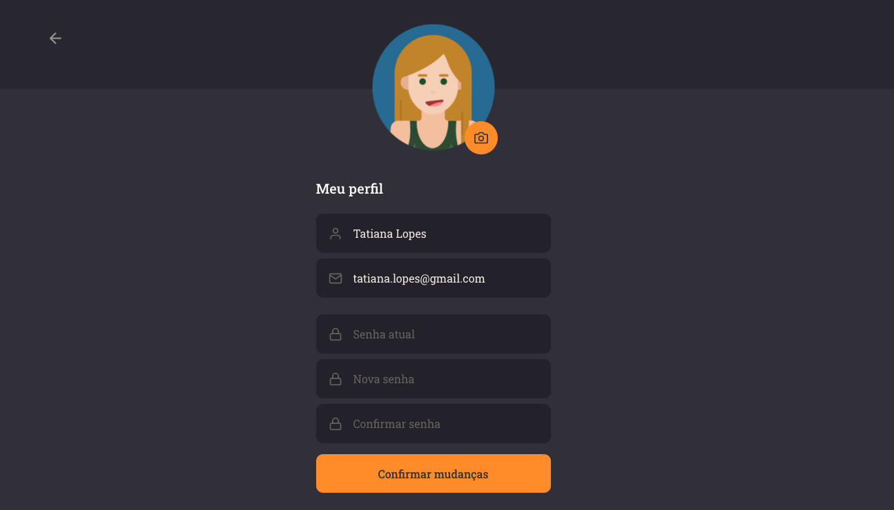
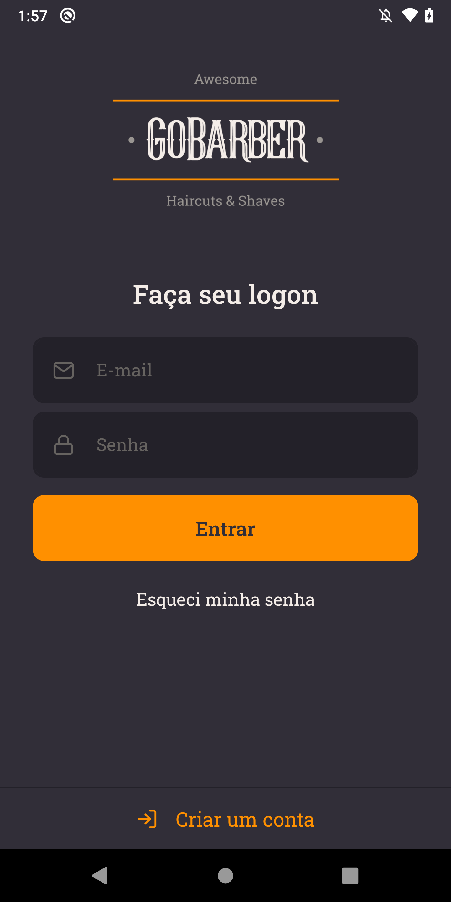
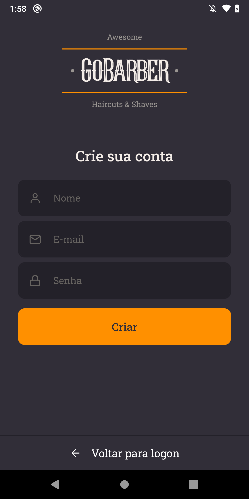
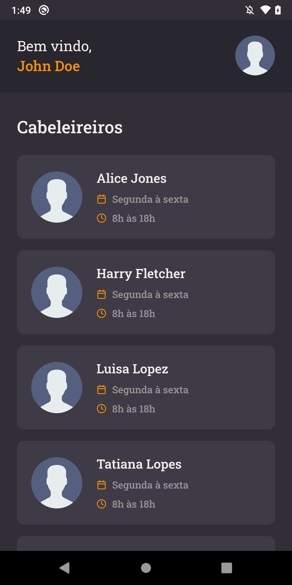
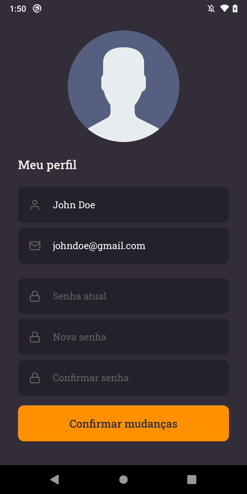
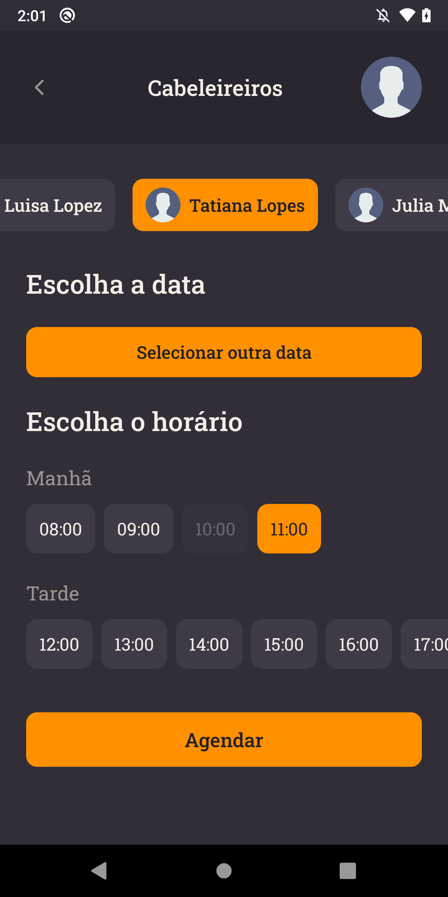
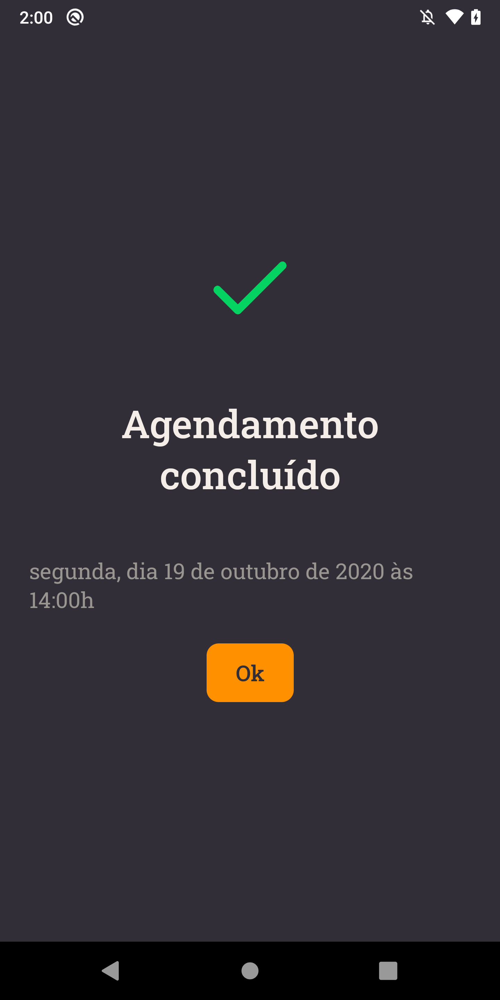

<h1 align="center"></h1>

<div align="center">

     

   [Backend](#Backend) | [Frontend](#Frontend) | [Mobile](#Mobile)

</div>

<h3>
    Application to manage appointments in a barber shop.
</h3>

<p align="center">
    
</p>

## Prerequisites

- yarn
- node
- postgres
- mongoDB
- redis

## Backend

The project's backend was developed in NodeJS using the following databases: PostgreSQL, MongoDB and Redis. Therefore, in order to run the backend you need to have all the databases configured (I used docker).

### Steps to run

1. Configure the databases
2. Set the needed variables in a `.env` file according to `.env.example`
3. Go to the *backend* folder
4. Install dependencies:
    ```
    yarn
    ```
5. Run project: 
    ```
    yarn dev:server
    ```

### Configure databases using docker

1. Create the required containers
    ```
    docker run --name postegres -e POSTGRES_PASSWORD=docker -p 5432:5432 -d postgres
    docker run --name mongo -p 27017:27017 -d -t mongo
    docker run --name redis -p 6379:6379 -d -t redis:alpine
    ```
2. Create a postgres databse (I used DBeaver) and then run the migrations
    ```
    yarn dev:server
    ```
3. Start the containers before starting the backend
    ```
    docker start <container_id>
    ```

## Frontend

The project's frontend was developed in ReactJS.

### Steps to run

1. Go to the *frontend* folder
2. Install dependencies:
    ```
    yarn
    ```
3. Run application: 
    ```
    yarn start
    ```

### Screens

<p align="center">
    
    
    
    
</p>

## Mobile

The project's mobile application was developed in React Native.

### Steps to run

1. Go to the *mobile* folder
2. Install dependencies:
    ```
    yarn
    ```
3. Run application: 
    ```
    yarn android
    ```

### Screens

<p align="center">
    
    
    
    
    
    
</p>

<div align="center">
  <sub>This project was developed during the GoStack Bootcamp by
  <a href="https://rocketseat.com.br/">Rocketseat</a>
</div>

<div align="center">
  <sub>This project was creted using my
  <a href="https://github.com/tatianalopes/web-project-template">Web project template</a>
</div>

<div align="center">
  <sub>Avatar default icon made by <a href="https://www.flaticon.com/authors/smashicons" title="Smashicons">Smashicons</a> from <a href="https://www.flaticon.com/" title="Flaticon">www.flaticon.com</a>
</div>