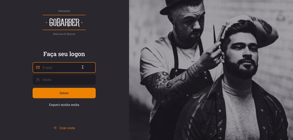
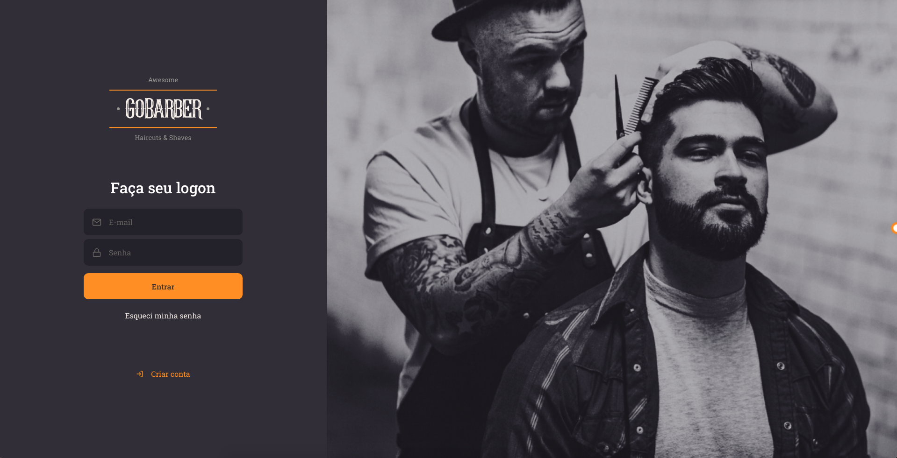

<h1 align="center"></h1>

<div align="center">

     

   [Backend](#Backend) | [Frontend](#Frontend)

</div>

<h3>
    Application to manage appointments in a barber shop.
</h3>

<p align="center">
    
</p>

## Prerequisites

- yarn
- node

## Backend

The application's backend was developed in NodeJS using PostgreSQL as the database.

### Start

1. Go to the *backend* folder
2. Install dependencies:
    ```
    yarn
    ```
3. Run project: 
    ```
    yarn dev:server
    ```

## Frontend

The application's frontend was developed in ReactJS.

### Start

1. Go to the *frontend* folder
2. Install dependencies:
    ```
    yarn
    ```
3. Run application: 
    ```
    yarn start
    ```

### Screens

<p align="center">
    
    
</p>

<div align="center">
  <sub>This project was developed during the GoStack Bootcamp by
  <a href="https://rocketseat.com.br/">Rocketseat</a>
</div>

<div align="center">
  <sub>This project was creted using my
  <a href="https://github.com/tatianalopes/web-project-template">Web project template</a>
</div>
